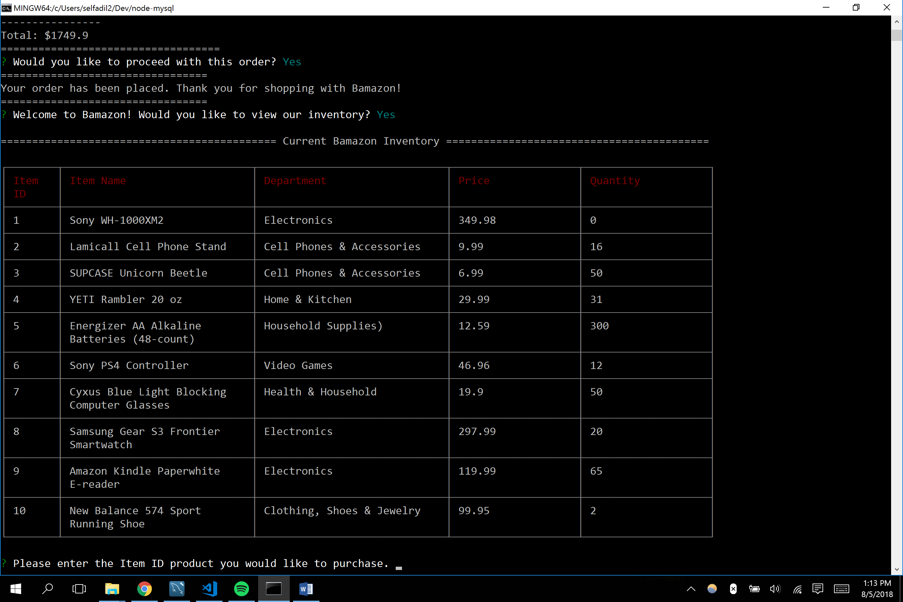

This is bamazon, an Amazon-like storefront built with MySQL skills and Node.js skills learned in week 12 of the GW Coding Bootcamp. 

This app takes orders in the terminal from customers using Node.js and manages the store's inventory using MySQL.

The progression goes as follows:

